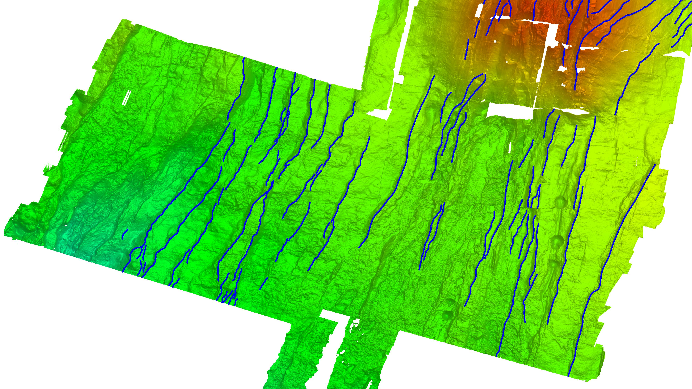

# Semi-supervised sea floor fault detection
Sea floor fault detection - Digital Geoscience Hackathon  2019 @ IPGP

J. CHEN, T. COOWAR, J. KUEHNERT, A.NEVEN, A.TRABATTONI, C. TRASSOUDAINE, V. VADDINENI

November 15-16th, 2019

---

The interpretation of faults along mid-ocean ridges is an important task in order to better understand tectonic mechanisms. However, the analysis relies on the detection of fault lines which can be extremely laborious when picked manually from the bathymetry. The proposed method uses a semi-supervised convolutional network to detect faults. It employs the U-Net network (Ronneberger et al., 2015) and a so-called IoU metric (mean average precision at different intersection over union).

The Figure below shows the raw bathimetric data set together with the manually picked faults (blue lines) which are used to train the network.

